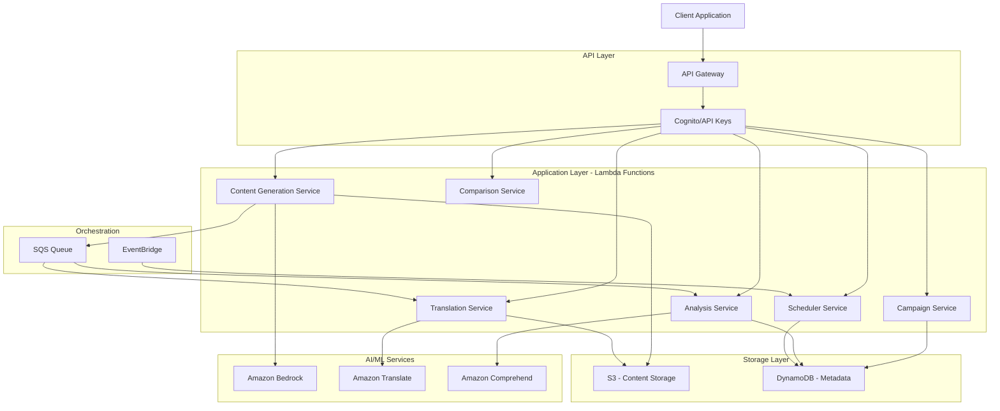

# Design Document: PerspectiveAI

## Overview

PerspectiveAI is a serverless, AI-powered content personalization platform built on AWS that enables users to create perspective-aware, multilingual content for social media campaigns. The system follows a microservices architecture using AWS Lambda functions orchestrated through API Gateway, with Amazon Bedrock for AI content generation, Amazon Translate for multilingual support, and Amazon Comprehend for sentiment analysis.

The platform is designed for Bharat-scale deployment with a focus on:
- Serverless scalability using AWS Lambda and managed services
- Regional Indian language support for diverse audiences
- Perspective-based content adaptation (Beginner, Expert, Skeptic, Policymaker, Investor, General Public)
- Multi-platform social media integration (Instagram, X, LinkedIn, WhatsApp, Facebook)
- Comprehensive content management and scheduling capabilities

## Architecture

### High-Level Architecture



### Architectural Principles

1. **Serverless-First**: All compute operations use AWS Lambda for automatic scaling and cost efficiency
2. **Event-Driven**: Asynchronous processing using SQS and EventBridge for decoupling and resilience
3. **Managed Services**: Leverage AWS managed AI/ML services to avoid infrastructure management
4. **Data Separation**: Content in S3, metadata in DynamoDB for optimized access patterns
5. **Security by Design**: IAM roles, API authentication, and encryption at rest and in transit

## Components and Interfaces

### 1. Campaign Service

**Responsibility**: Manage campaign creation, retrieval, and lifecycle

**API Endpoints**:
- `POST /campaigns` - Create new campaign
- `GET /campaigns/{campaignId}` - Retrieve campaign details
- `GET /campaigns` - List user campaigns
- `DELETE /campaigns/{campaignId}` - Delete campaign

**Interface**:
```typescript
interface Campaign {
  campaignId: string;
  userId: string;
  coreMessage: string;
  platforms: Platform[];
  createdAt: string;
  updatedAt: string;
  status: 'draft' | 'active' | 'archived';
}

interface CreateCampaignRequest {
  coreMessage: string;
  platforms: Platform[];
}

interface CreateCampaignResponse {
  campaign: Campaign;
}
```

**DynamoDB Schema**:
- Table: `Campaigns`
- Partition Key: `campaignId` (String)
- GSI: `userId-createdAt-index` for user campaign listing

### 2. Content Generation Service

**Responsibility**: Generate perspective-aware content using Amazon Bedrock

**API Endpoints**:
- `POST /campaigns/{campaignId}/generate` - Generate content for perspectives

**Interface**:
```typescript
interface GenerateContentRequest {
  campaignId: string;
  perspectives: Perspective[];
  platform: Platform;
}

interface GenerateContentResponse {
  contentVariants: ContentVariant[];
  jobId: string;
}

interface ContentVariant {
  variantId: string;
  campaignId: string;
  perspective: Perspective;
  platform: Platform;
  content: string;
  language: 'en';
  s3Key: string;
  createdAt: string;
}

type Perspective = 'Beginner' | 'Expert' | 'Skeptic' | 'Policymaker' | 'Investor' | 'GeneralPublic';
type Platform = 'Instagram' | 'X' | 'LinkedIn' | 'WhatsApp' | 'Facebook';
```

**Bedrock Integration**:
- Model: Claude 3 or similar foundation model
- Prompt Template: System prompt with perspective context + user core message
- Parameters: Temperature, max tokens, top-p configured per perspective

**Processing Flow**:
1. Validate campaign exists and user has access
2. For each perspective, construct prompt with perspective-specific instructions
3. Invoke Bedrock model with prompt
4. Store generated content in S3
5. Store metadata in DynamoDB
6. Enqueue translation and analysis jobs in SQS
7. Return job ID for status tracking

### 3. Translation Service

**Responsibility**: Translate content to regional Indian languages using Amazon Translate

**API Endpoints**:
- `POST /campaigns/{campaignId}/translate` - Translate content variants

**Interface**:
```typescript
interface TranslateContentRequest {
  variantId: string;
  targetLanguages: string[]; // ISO 639-1 codes
}

interface TranslateContentResponse {
  translations: TranslatedVariant[];
}

interface TranslatedVariant {
  variantId: string;
  originalVariantId: string;
  language: string;
  content: string;
  s3Key: string;
  createdAt: string;
}
```

**Supported Languages** (Amazon Translate regional Indian languages):
- Hindi (hi)
- Bengali (bn)
- Tamil (ta)
- Telugu (te)
- Marathi (mr)
- Gujarati (gu)
- Kannada (kn)
- Malayalam (ml)
- Punjabi (pa)

**Processing Flow**:
1. Retrieve original content from S3
2. For each target language, invoke Amazon Translate
3. Store translated content in S3
4. Store translation metadata in DynamoDB
5. Enqueue sentiment analysis for translated content

### 4. Analysis Service

**Responsibility**: Analyze sentiment and content suitability using Amazon Comprehend

**API Endpoints**:
- `POST /campaigns/{campaignId}/analyze` - Analyze content variants

**Interface**:
```typescript
interface AnalyzeContentRequest {
  variantId: string;
}

interface AnalyzeContentResponse {
  analysis: ContentAnalysis;
}

interface ContentAnalysis {
  variantId: string;
  sentiment: SentimentScore;
  keyPhrases: string[];
  entities: Entity[];
  flagged: boolean;
  analyzedAt: string;
}

interface SentimentScore {
  sentiment: 'POSITIVE' | 'NEGATIVE' | 'NEUTRAL' | 'MIXED';
  positive: number;
  negative: number;
  neutral: number;
  mixed: number;
}

interface Entity {
  text: string;
  type: string;
  score: number;
}
```

**Processing Flow**:
1. Retrieve content from S3
2. Invoke Amazon Comprehend DetectSentiment API
3. Invoke Amazon Comprehend DetectKeyPhrases API
4. Invoke Amazon Comprehend DetectEntities API
5. Apply flagging rules based on sentiment thresholds
6. Store analysis results in DynamoDB

### 5. Comparison Service

**Responsibility**: Retrieve and format content variants for side-by-side comparison

**API Endpoints**:
- `GET /campaigns/{campaignId}/compare` - Get all variants for comparison

**Interface**:
```typescript
interface CompareContentRequest {
  campaignId: string;
  filters?: {
    perspectives?: Perspective[];
    languages?: string[];
    platforms?: Platform[];
  };
}

interface CompareContentResponse {
  campaign: Campaign;
  variants: EnrichedContentVariant[];
}

interface EnrichedContentVariant extends ContentVariant {
  translations: TranslatedVariant[];
  analysis: ContentAnalysis;
}
```

**Processing Flow**:
1. Retrieve campaign metadata from DynamoDB
2. Query all content variants for the campaign
3. For each variant, retrieve translations and analysis
4. Apply filters if provided
5. Return enriched variant data

### 6. Scheduler Service

**Responsibility**: Manage post scheduling and delivery

**API Endpoints**:
- `POST /campaigns/{campaignId}/schedule` - Schedule a post
- `GET /schedules` - List scheduled posts
- `DELETE /schedules/{scheduleId}` - Cancel scheduled post

**Interface**:
```typescript
interface SchedulePostRequest {
  variantId: string;
  platform: Platform;
  scheduledTime: string; // ISO 8601
}

interface SchedulePostResponse {
  schedule: ScheduledPost;
}

interface ScheduledPost {
  scheduleId: string;
  variantId: string;
  platform: Platform;
  scheduledTime: string;
  status: 'pending' | 'published' | 'failed' | 'cancelled';
  createdAt: string;
  publishedAt?: string;
}
```

**DynamoDB Schema**:
- Table: `ScheduledPosts`
- Partition Key: `scheduleId` (String)
- GSI: `status-scheduledTime-index` for querying pending posts

**EventBridge Integration**:
- Rule: Trigger every 5 minutes
- Target: Scheduler Lambda function
- Function queries pending posts due for publication

**Processing Flow**:
1. Validate scheduled time is in the future
2. Store schedule in DynamoDB with 'pending' status
3. EventBridge triggers scheduler Lambda periodically
4. Lambda queries pending posts with scheduledTime <= now
5. For each post, invoke platform-specific delivery logic
6. Update status to 'published' or 'failed'

## Data Models

### DynamoDB Tables

**Campaigns Table**:
```typescript
{
  campaignId: string;          // PK
  userId: string;              // GSI PK
  coreMessage: string;
  platforms: string[];
  status: string;
  createdAt: string;           // GSI SK
  updatedAt: string;
}
```

**ContentVariants Table**:
```typescript
{
  variantId: string;           // PK
  campaignId: string;          // GSI PK
  perspective: string;
  platform: string;
  language: string;
  s3Key: string;
  originalVariantId?: string;  // For translations
  createdAt: string;
}
```

**ContentAnalysis Table**:
```typescript
{
  variantId: string;           // PK
  sentiment: {
    sentiment: string;
    positive: number;
    negative: number;
    neutral: number;
    mixed: number;
  };
  keyPhrases: string[];
  entities: object[];
  flagged: boolean;
  analyzedAt: string;
}
```

**ScheduledPosts Table**:
```typescript
{
  scheduleId: string;          // PK
  variantId: string;
  platform: string;
  scheduledTime: string;       // GSI SK
  status: string;              // GSI PK
  createdAt: string;
  publishedAt?: string;
  errorMessage?: string;
}
```

### S3 Structure

```
perspective-ai-content/
  {campaignId}/
    variants/
      {variantId}.json
    translations/
      {variantId}-{language}.json
```

Each JSON file contains:
```typescript
{
  content: string;
  metadata: {
    perspective?: string;
    platform: string;
    language: string;
    generatedAt: string;
  }
}
```


## Correctness Properties

A property is a characteristic or behavior that should hold true across all valid executions of a system—essentially, a formal statement about what the system should do. Properties serve as the bridge between human-readable specifications and machine-verifiable correctness guarantees.

### Property 1: Input Validation Consistency

*For any* user input (core message, platform selection, scheduled time), the validation logic should consistently accept valid inputs and reject invalid inputs according to the defined rules (non-empty messages, at least one platform, future timestamps).

**Validates: Requirements 1.1, 1.3, 7.1**

### Property 2: Campaign Storage Round-Trip

*For any* valid campaign creation request, storing the campaign and then retrieving it should return an equivalent campaign with all original data preserved and a unique campaign identifier assigned.

**Validates: Requirements 1.2**

### Property 3: AWS Service Integration Correctness

*For any* content generation, translation, or analysis request, the system should invoke the corresponding AWS service (Bedrock, Translate, Comprehend) with correctly formatted parameters including the content, target configuration, and required metadata.

**Validates: Requirements 2.1, 3.1, 4.1**

### Property 4: AWS Response Validation

*For any* response from AWS services (Bedrock, Translate, Comprehend), the system should validate the response structure and extract all required fields (content, sentiment scores, key phrases, entities) before processing.

**Validates: Requirements 2.3, 3.3, 4.2, 4.3**

### Property 5: Content Storage Consistency

*For any* generated or translated content, if the content is stored in S3, then the corresponding metadata must exist in DynamoDB with matching identifiers, and vice versa.

**Validates: Requirements 5.1, 5.2, 5.5**

### Property 6: Content Retrieval Completeness

*For any* campaign with N content variants, retrieving the campaign data should return all N variants with their translations and analysis results.

**Validates: Requirements 5.3, 6.1**

### Property 7: Content Versioning Preservation

*For any* content that is updated M times, the storage system should maintain M versions, and retrieving version history should return all M versions in chronological order.

**Validates: Requirements 5.4**

### Property 8: Sentiment-Based Flagging

*For any* content analysis result, if the sentiment scores exceed the inappropriate content thresholds (e.g., negative > 0.8), then the flagged field should be set to true.

**Validates: Requirements 4.5**

### Property 9: Response Metadata Completeness

*For any* API response containing content variants, each variant should include all required metadata fields: perspective, platform, language, sentiment scores, and key phrases.

**Validates: Requirements 6.3, 4.4**

### Property 10: Filter Correctness

*For any* collection of content variants and any filter criteria (perspective, language, platform, status), the filtered results should only include variants that match all specified filter criteria.

**Validates: Requirements 6.4, 7.5**

### Property 11: Schedule Time Validation

*For any* post scheduling request, if the scheduled time is in the past or current time, the request should be rejected with a validation error.

**Validates: Requirements 7.1**

### Property 12: Scheduled Post Delivery

*For any* scheduled post with status 'pending' and scheduledTime <= current time, the scheduler should trigger delivery and update the status to either 'published' or 'failed'.

**Validates: Requirements 7.2**

### Property 13: Schedule Cancellation

*For any* scheduled post that is cancelled before its scheduled time, the status should be updated to 'cancelled' and the post should not be delivered when the scheduled time arrives.

**Validates: Requirements 7.4**

### Property 14: Retry with Exponential Backoff

*For any* AWS service call that fails, the system should retry with exponentially increasing delays (e.g., 1s, 2s, 4s, 8s) up to the maximum retry count before giving up.

**Validates: Requirements 9.1**

### Property 15: Error Logging Completeness

*For any* error that occurs in the system, the error log should contain sufficient context including: timestamp, service name, operation, error message, and request identifiers.

**Validates: Requirements 9.3**

### Property 16: Batch Partial Success Handling

*For any* batch operation with N items where M items fail (M < N), the system should successfully process (N - M) items and return a response indicating which specific items failed with their error messages.

**Validates: Requirements 9.4**

### Property 17: Circuit Breaker State Transitions

*For any* external service, if consecutive failures exceed the threshold, the circuit breaker should open (reject requests immediately), and after the timeout period with successful health checks, it should close (allow requests again).

**Validates: Requirements 9.5**

### Property 18: Authentication Enforcement

*For any* API request without valid authentication credentials (Cognito token or API key), the system should reject the request with HTTP 401 Unauthorized status.

**Validates: Requirements 10.2**

### Property 19: Input Validation and Status Codes

*For any* API request with invalid input (wrong types, missing required fields, out-of-range values), the system should reject the request with HTTP 400 Bad Request and a descriptive error message.

**Validates: Requirements 10.3**

### Property 20: Rate Limiting Enforcement

*For any* client making more than the allowed number of requests within the time window, subsequent requests should be rejected with HTTP 429 Too Many Requests until the window resets.

**Validates: Requirements 10.4**

## Error Handling

### Error Categories

1. **Validation Errors**: Invalid user input, failed business rule checks
   - HTTP 400 Bad Request
   - Descriptive error messages with field-level details

2. **Authentication/Authorization Errors**: Missing or invalid credentials, insufficient permissions
   - HTTP 401 Unauthorized or 403 Forbidden
   - Generic error messages to avoid information leakage

3. **AWS Service Errors**: Bedrock, Translate, Comprehend, S3, DynamoDB failures
   - Retry with exponential backoff
   - Circuit breaker pattern for repeated failures
   - HTTP 503 Service Unavailable after retries exhausted

4. **Resource Not Found**: Campaign, variant, or schedule doesn't exist
   - HTTP 404 Not Found
   - Include resource type and identifier in error message

5. **Rate Limiting**: Too many requests from client
   - HTTP 429 Too Many Requests
   - Include Retry-After header

### Error Response Format

```typescript
interface ErrorResponse {
  error: {
    code: string;           // Machine-readable error code
    message: string;        // Human-readable error message
    details?: object;       // Additional context (validation errors, etc.)
    requestId: string;      // For tracking and debugging
  };
}
```

### Retry Strategy

- **Retryable Errors**: Network timeouts, 5xx errors from AWS services, throttling errors
- **Non-Retryable Errors**: 4xx validation errors, authentication failures
- **Backoff**: Exponential with jitter (1s, 2s, 4s, 8s, 16s)
- **Max Retries**: 5 attempts
- **Circuit Breaker**: Open after 5 consecutive failures, half-open after 60s, close after 2 successful requests

### Logging Strategy

All errors logged with:
- Timestamp (ISO 8601)
- Service name and function name
- Operation being performed
- Request ID for correlation
- Error type and message
- Stack trace (for unexpected errors)
- User ID and campaign ID (when available)

Logs sent to CloudWatch Logs with appropriate log levels:
- ERROR: Unexpected failures, exhausted retries
- WARN: Retryable errors, validation failures
- INFO: Successful operations, state transitions

## Testing Strategy

### Dual Testing Approach

The testing strategy employs both unit tests and property-based tests as complementary approaches:

- **Unit Tests**: Verify specific examples, edge cases, and error conditions with concrete test data
- **Property-Based Tests**: Verify universal properties across randomly generated inputs to catch edge cases we might not think of

Together, these approaches provide comprehensive coverage where unit tests catch concrete bugs and property-based tests verify general correctness across the input space.

### Property-Based Testing

**Library Selection**: 
- For TypeScript/JavaScript: `fast-check`
- For Python: `hypothesis`

**Configuration**:
- Minimum 100 iterations per property test (due to randomization)
- Each test must include a comment tag referencing the design property
- Tag format: `// Feature: perspective-ai, Property N: [property title]`

**Property Test Implementation**:
- Each correctness property listed above must be implemented as a single property-based test
- Tests should generate random valid inputs (campaigns, content, perspectives, languages, etc.)
- Tests should verify the property holds for all generated inputs
- Failed tests should shrink to minimal failing examples for debugging

### Unit Testing

**Focus Areas**:
- Specific examples demonstrating correct behavior (e.g., generating content for "Beginner" perspective)
- Edge cases (empty campaigns, maximum length messages, boundary timestamps)
- Error conditions (AWS service failures, invalid authentication, rate limit exceeded)
- Integration points between components (campaign creation → content generation → translation → analysis)

**Test Organization**:
- One test file per Lambda function/service
- Group tests by functionality (happy path, validation, error handling)
- Use mocks for AWS services (Bedrock, Translate, Comprehend, S3, DynamoDB)
- Use test fixtures for common test data

### Integration Testing

**Scope**:
- End-to-end flows: Campaign creation → content generation → translation → analysis → comparison
- Asynchronous processing: SQS message handling, EventBridge scheduling
- Data consistency: S3 and DynamoDB synchronization

**Approach**:
- Use LocalStack or AWS SAM Local for local AWS service emulation
- Test with realistic data volumes
- Verify eventual consistency in asynchronous operations

### Test Coverage Goals

- Line coverage: > 80%
- Branch coverage: > 75%
- Property tests: 100% of correctness properties implemented
- Critical paths: 100% coverage (authentication, content generation, storage)
